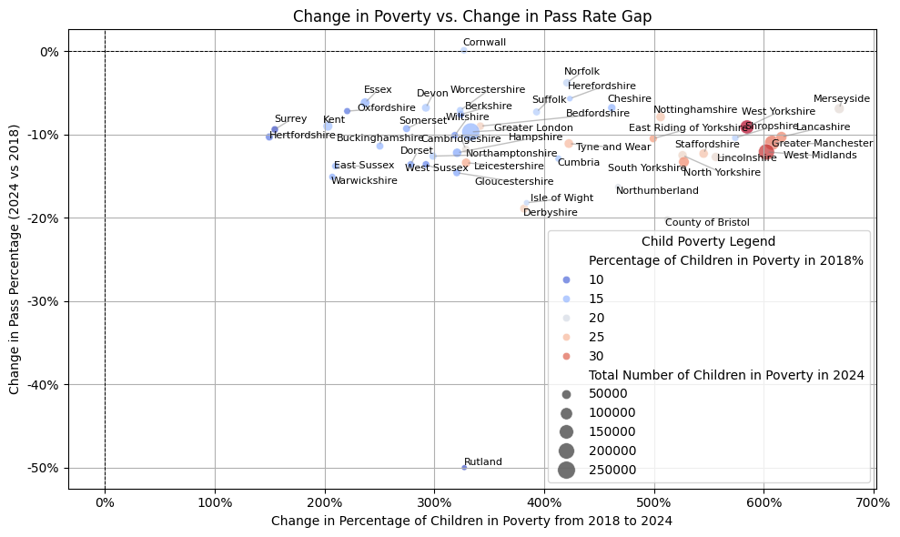

# 📊 Child Poverty and GCSE Outcomes — Local Authority Level Analysis comaprison between 2018 and 2024

This project explores the relationship between child poverty levels across 
England's local authorities and their corresponding educational outcomes, particularly focusing on GCSE re-sit performance. The idea is that the most disadvantaged students are also the ones going through the re-sit path.

---

## 💡 **Objective**

To analyze the 2018-2024 child poverty statistics and link them to educational performance (measured via GCSE resit passing percentage) at a local authority level, by:

- Mapping local authority names to their corresponding counties.
- Calculating **weighted averages** of child poverty rates where applicable.
- Identifying mismatches and harmonizing local authority and county naming for consistent reporting.
- Visualizing the key findings.

---

## 🗂️ **Data Sources**

- **Child Poverty Data (2018)**: Estimated number and percentage of children living in poverty by local authority.
- **GCSE Results Dataset (2018)**: Average performance scores per county or local authority.
- **Child Poverty Data (2024)**: Estimated number and percentage of children living in poverty by local authority.
- **GCSE Results Dataset (2025)**: Average performance scores per county or local authority.

---

## ⚙️ **Data Processing Overview**

1. **Mapping**:  
    There were around 300 local authroities entries while 48 officalian counties in England. Therefore, Local authorities were mapped to their respective counties. A manual curation was necessary to resolve discrepancies in naming conventions across datasets.  

    

   Example:
   ```python
   local_authority_to_county = {
       'Ashford': 'Kent',
       'Babergh': 'Suffolk',
       'Bath and North East Somerset': 'Bath and North East Somerset',
       'Salford': 'Greater Manchester',
       'Stockport': 'Greater Manchester'
       ...
   }
   ```

   This step was performed due to the lack of local GCSE results per local authroties in England
   
2. **Aggregation**:  
   Where multiple local authorities corresponded to a single county, data was aggregated using weighted averages, particularly:

   ```
   Weighted Child Poverty % = (Total Children in Poverty across LAs) / (Total Child Population in County) * 100
   ```

3. **Visualization**:  
   Results were visualized to highlight disparities and trends.

---

## 🖼️ **Figure: Results Overview**



📝 **Notes on Figure:**

-  The total number of children in poverty, 2024, aggregated at the county level.
- Historical weighted percentage of child poverty for the same counties as measured in 2018. The 2018 data point was taken in attempt to see the possible effect of the starting point

There has been an increase of Child Poverty in the whole of the UK, but some areas were more affected, and some areas had worse starting point in 2018

---

## 💡 **Key Takeaways**

- The GCSE pass rate (grade 4 or above) in English Language across England has gone down by 10 % 
- At the same time, there has been an increase in child poverty throughout the whole country 
- Changes in local authority structures and naming conventions required careful manual mapping for reliable aggregation.
- The approach can be adapted for future yearly data to track socioeconomic changes over time.

---

